# Clipboard Manager [WIP]

A Windows-like clipboard manager for Linux, designed for efficiency and ease of use, particularly for users of tiling window managers like Hyprland.

## 1\. Project Summary and Motivation

This clipboard manager is a powerful tool for Linux users who want to keep a history of the items they've copied. It captures both text and images, storing them for later use. The motivation behind this project is to provide a lightweight, terminal-based clipboard history solution that integrates seamlessly into modern Linux desktop environments, especially those using Wayland and tiling window managers. Unlike many other clipboard managers, this one is designed with a specific focus on providing a simple, floating terminal UI that can be quickly summoned with a keyboard shortcut.

## 2\. Feature List and Target Audience

### Features

- **Clipboard History**: Keeps a record of the last 50 items copied to the clipboard.
- **Text and Image Support**: Captures both text and image data.
- **Daemon Mode**: Runs as a background process to continuously monitor the clipboard.
- **Terminal UI**: A simple, intuitive terminal-based user interface for browsing and selecting clipboard history.
- **Wayland and X11 Support**: Automatically detects and supports both Wayland (using `wl-clipboard`) and X11 (using `arboard`).
- **Duplicate Prevention**: Avoids saving duplicate entries by hashing clipboard content.
- **Persistent History**: Saves the clipboard history to a JSON file, so it persists across reboots.
- **Image Previews**: Displays image dimensions and file sizes in the history list.

### Target Audience

This project is aimed at Linux power users, developers, and anyone who frequently works with text and images and wants a more efficient clipboard workflow. It's particularly well-suited for users of tiling window managers like Hyprland who prefer keyboard-driven, terminal-based tools.

## 3\. Architecture and Internal Flow

The application is architected into two main components: a background **daemon** that monitors the clipboard and a terminal-based **user interface (TUI)** for interacting with the clipboard history.

### Architecture Diagram



### Internal Flow

1.  **Daemon Initialization**: When the application is started without the `--ui` flag, it enters daemon mode.
2.  **Clipboard Monitoring**: The daemon spawns a thread that continuously polls the system clipboard at a set interval (150ms).
3.  **Content Detection**: The monitor checks for new text or image content. It prioritizes images over text if both are present.
4.  **Hashing and Duplicate Check**: When new content is detected, its hash is computed and compared against the hashes of existing entries in the history to prevent duplicates.
5.  **History Management**: If the content is new, a `ClipboardEntry` is created and added to the front of a `VecDeque`. Text is stored directly, while images are saved to an `images` directory and the filename is stored. The history is capped at a maximum number of entries (50).
6.  **Persistence**: The clipboard history is serialized to a JSON file (`clipboard_history.json`) in the user's data directory.
7.  **UI Trigger**: The user can trigger the TUI with a keyboard shortcut. A trigger script is created to launch the UI in a floating terminal window.
8.  **UI Display**: The TUI, built with `ratatui`, reads the JSON history file and displays the entries in a list.
9.  **User Selection**: The user can navigate the list and select an entry.
10. **Clipboard Update**: When an entry is selected, its content is copied back to the system clipboard.

## 4\. Development and Installation

### Prerequisites

- Rust and Cargo
- `wl-clipboard` (for Wayland)

### Installation from Source (Cargo)

1.  Clone the repository:
    ```bash
    git clone https://github.com/grenish/clipboard-manager.git
    cd clipboard-manager
    ```
2.  Build and install the binary:
    ```bash
    cargo install --path .
    ```

### Installation from AUR (Arch User Repository)

You can install `clipboard-manager` from the Arch User Repository (AUR) using your favorite AUR helper (e.g., `yay`, `paru`).

```bash
yay -S clipboard-manager-rs-git
```

## 5\. Configuration and Usage

### Running the Daemon

To start the clipboard manager in daemon mode, simply run the binary in your shell:

```bash
clipboard-manager &
```

It's recommended to add this command to your window manager's startup configuration (e.g., `hyprland.conf`).

### Triggering the UI

The application creates a trigger script at `~/.local/share/clipboard-manager/trigger.sh`. You can bind this script to a keyboard shortcut in your window manager's configuration.

**Hyprland Example:**

Add the following lines to your `hyprland.conf`:

```
# Trigger with Super+Comma (You could configure your own)
bind = SUPER, comma, exec, ~/.local/share/clipboard-manager/trigger.sh

# Make clipboard window float and centered (like Windows!)
windowrulev2 = float, class:(floating-clipboard)
windowrulev2 = size 900 600, class:(floating-clipboard)
windowrulev2 = center, class:(floating-clipboard)
windowrulev2 = animation popin, class:(floating-clipboard)
windowrulev2 = stayfocused, class:(floating-clipboard)
```

## 6\. Testing and CI

Currently, the project does not have any automated tests or a CI pipeline. Contributions in this area are welcome.

## 7\. Performance and Security Notes

### Performance

- The clipboard is monitored by polling at a fixed interval of 150ms. This approach is simple but may not be the most efficient. Future versions could explore using system-level clipboard events to avoid polling.

### Security

- The clipboard history, including text and paths to images, is stored in a plain-text JSON file in `~/.local/share/clipboard-manager/`. If you copy sensitive information like passwords or private keys, they will be saved to this file in an unencrypted format. Be mindful of this when using the application.
- Images are stored as PNG files in `~/.local/share/clipboard-manager/images/`.

## 8\. License

This project is licensed under the MIT License. See the [LICENSE](https://www.google.com/search?q=LICENSE) file for details.
