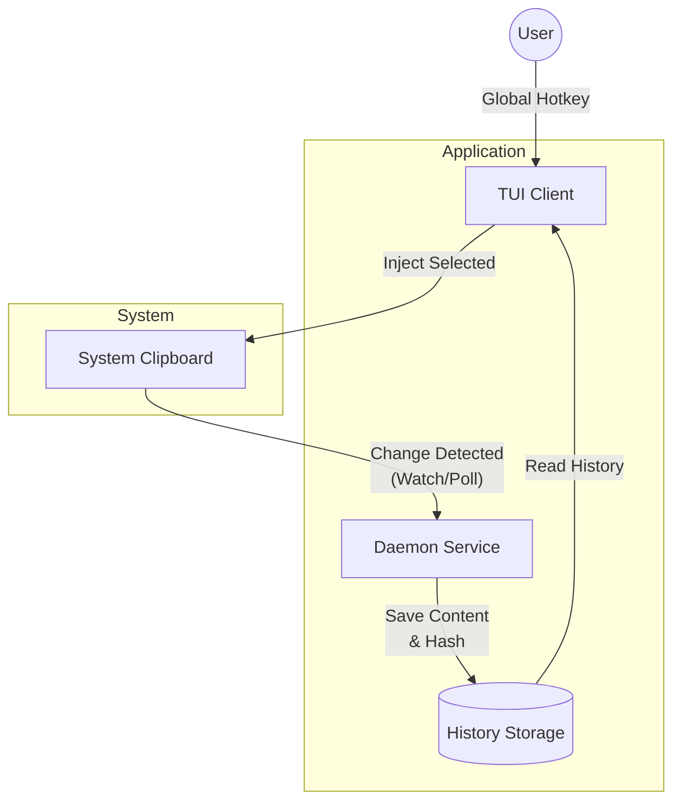

# Clipboard Manager

A lightweight, terminal-based clipboard manager for Linux, designed for efficiency and seamless integration with tiling window managers like Hyprland.

[](LICENSE)
[](https://www.rust-lang.org/)

## Overview

Clipboard Manager is a high-performance daemon and TUI (Text User Interface) tool that captures and manages clipboard history. It supports both text and images, offering a persisting history that survives reboots. Built with Rust, it prioritizes low resource usage and speed, making it an ideal companion for keyboard-centric workflows on Wayland and X11.

## Features

- **Clipboard History**: Automatically captures the last 50 clipboard entries.
- **Content Support**: Handles both text and images (with preview metadata).
- **Smart Deduplication**: Re-copying existing content moves it to the top of the history.
- **Persistence**: History is saved to disk, preserving context across sessions.
- **Auto-Configuration**: Automatically detects Hyprland and applies necessary window rules.
- **Daemon Mode**: Efficient background process for continuous monitoring.
- **Terminal UI**: Fast, responsive `ratatui`-based interface for history navigation.
- **Protocol Support**: Native support for Wayland (`wl-clipboard` watcher) and X11.

## Architecture

The system operates as two distinct components:

1.  **Daemon**: A background service that monitors the system clipboard.
    - **Wayland**: Uses `wl-paste --watch` for instant, event-based capture.
    - **X11**: Falls back to efficient polling.
2.  **TUI Client**: A transient interface triggered by the user to browse history and inject selected content back into the system clipboard.



## Installation

### AUR (Arch User Repository)

For Arch Linux users, the package is available via AUR:

```bash
yay -S clipboard-manager-rs-git
```

### From Source

Ensure you have Rust and Cargo installed.

```bash
git clone https://github.com/grenish/clipboard-manager.git
cd clipboard-manager
cargo install --path .
```

_Note: Wayland users require `wl-clipboard` installed._

## Usage

### 1. Start the Daemon

Launch the daemon in the background (preferably via your window manager's init script, e.g., `exec-once = clipboard-manager` in Hyprland):

```bash
clipboard-manager &
```

On startup, the daemon will:

- Create a trigger script at `~/.local/share/clipboard-manager/trigger.sh`.
- **Automatically apply floating window rules** if Hyprland is detected.

### 2. Configure the Trigger

Bind a hotkey to execute the trigger script.

**Hyprland Example:**

```ini
bind = SUPER, comma, exec, ~/.local/share/clipboard-manager/trigger.sh
```

or

```ini
bind = SUPER, V, exec, ~/.local/share/clipboard-manager/trigger.sh
```

You can use any other key combination as per your preference.

## Migration Guide & Troubleshooting

### Hyprland 0.53+ Support

Hyprland v0.53 introduced breaking changes to window rules ("Missing value" errors).

**If you are on Hyprland v0.53 or newer:**

- This application now **automatically** detects your version and applies the correct `windowrule` syntax.
- You generally **do not** need manual window rules in your config anymore.

**If the window does not float automatically:**
Add the following manual fallback to your `hyprland.conf`:

```ini
# Hyprland v0.53+ Manual Config
windowrule = float on, match:class floating-clipboard
```

### Legacy Hyprland (v0.52 and older)

For older versions, the legacy automatic config should work. If not, use:

```ini
windowrulev2 = float, class:(floating-clipboard)
windowrulev2 = size 900 600, class:(floating-clipboard)
windowrulev2 = center, class:(floating-clipboard)
windowrulev2 = animation popin, class:(floating-clipboard)
```

## Data Storage & Security

- **Storage Location**: `~/.local/share/clipboard-manager/`
- **History File**: `clipboard_history.json` (Plain text)
- **Images**: `images/` subdirectory

**Security Notice**: Clipboard content is stored unencrypted. Avoid copying sensitive secrets (passwords, keys) if disk encryption is not active, or be mindful to clear the history.

## License

This project is open-source and licensed under the [MIT License](LICENSE).
